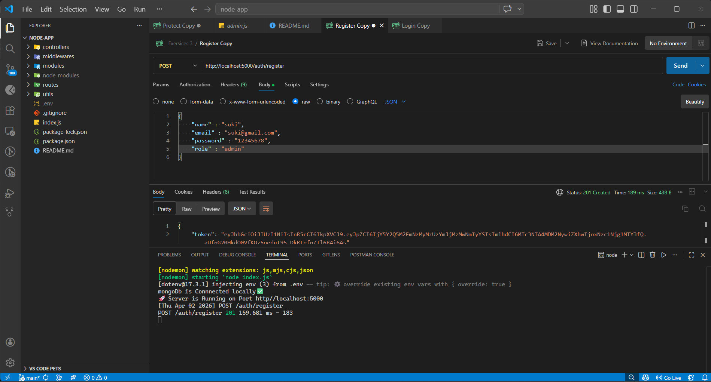
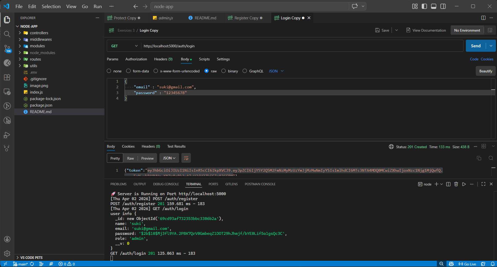
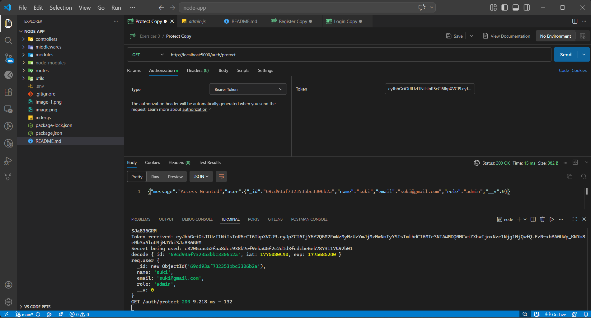
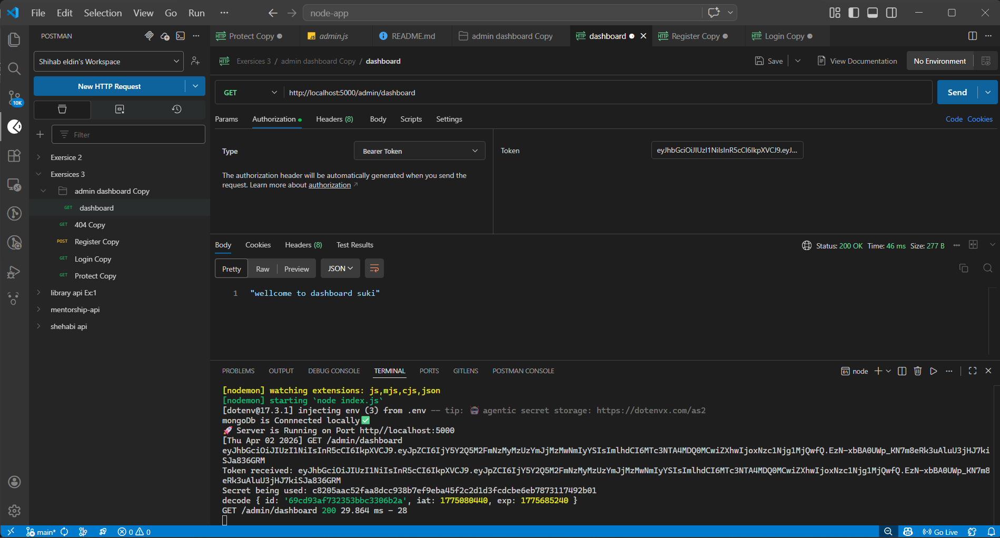

## 🧠 **Challenge: Build a Complete JWT-Based Auth System with Role-Based Access**

---

### 📝 **Challenge Description**

In this challenge, you will build a real-world authentication system using:

- JWT-based login & registration
- Password hashing
- Role-based authorization (admin vs regular user)
- Protected routes

You'll apply everything you've learned about middleware, validation, and error handling — and now you'll control **who can access what**.

---

### 🧠 What You Will Build

1. ✅ `POST /auth/register`
    - Create a new user
    - Hash the password
    - Return a token
    2. ✅ `POST /auth/login`
    - Authenticate a user
    - Return a JWT
3. ✅ `GET /auth/profile`
    - Only accessible with a valid JWT
    - Return the logged-in user’s info
4. ✅ `GET /admin/dashboard`
    - Only accessible if the logged-in user has `role: "admin"`
    - Return a welcome message

---

### 🛠 Functional Requirements

### ➕ **User Fields:**

- `name` (string)
- `email` (unique, string)
- `password` (string, hashed)
- `role` (default: `'user'`, can be `'admin'`)
### 🔐 **Authentication**

- Use `bcryptjs` to hash passwords
- Use `jsonwebtoken` to issue and verify JWTs
- Store JWT secret in `.env`

---

### 🧩 **Middlewares Required**

1. `protect` – verifies token and attaches `req.user`
2. `authorize` – only allows access to users with specific roles (e.g., `admin`)

